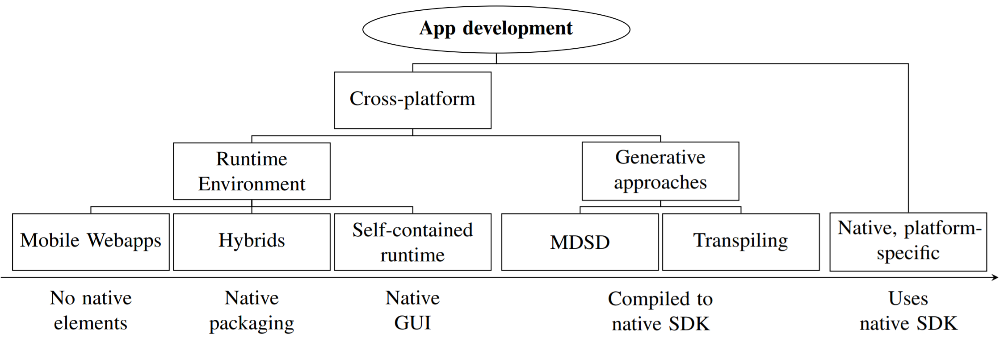

# Seminararbeit zum Thema Mobile App Development Frameworks

Diese Seminararbeit ist im SS21 bei [Prof. Dr. Häuslein](https://www.fh-wedel.de/wir/organisation/team/detail/profil/profile/show/Andreas-H%C3%A4uslein/) entstanden.
Diese liefert einen Überblick über die verschiedenen Entwicklungsansätze einer Mobile-App.

-- <cite>[Tim A. Majchrzak, Jan Ernsting und Herbert Kuchen, 2015 „Achieving Business Practicability of
Model-Driven Cross-Platform Apps“]</cite>

## Erstellung

Das LaTeX Template basiert auf der Vorlage von [Ulrich Hoffmann](https://github.com/fh-wedel/thesis-template).
Für die Bearbeitung wurde [TeX Studio](https://www.texstudio.org/) verwendet. Dabei wurde Biber als standard Bibliographie-Programm angegeben, da hierbei auch Online Referenzen angegeben werden können.
